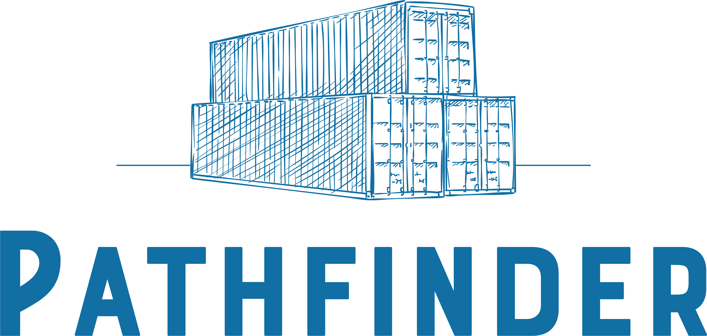
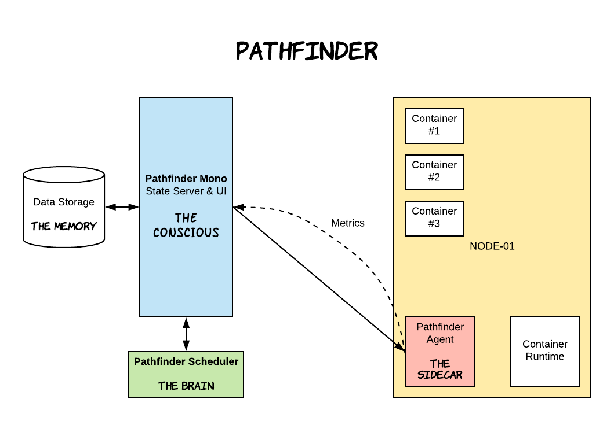

# Pathfinder Container Manager

> To get started quickly, please consult our quick development setup [here](https://github.com/pathfinder-cm/pathfinder-mono)

Pathfinder is a container manager (sometimes also called orchestrator), which functionality is to abstract away multiple computing nodes into a single unit of computing resource where people can assign workload (in form of container) into it.

## Overview

